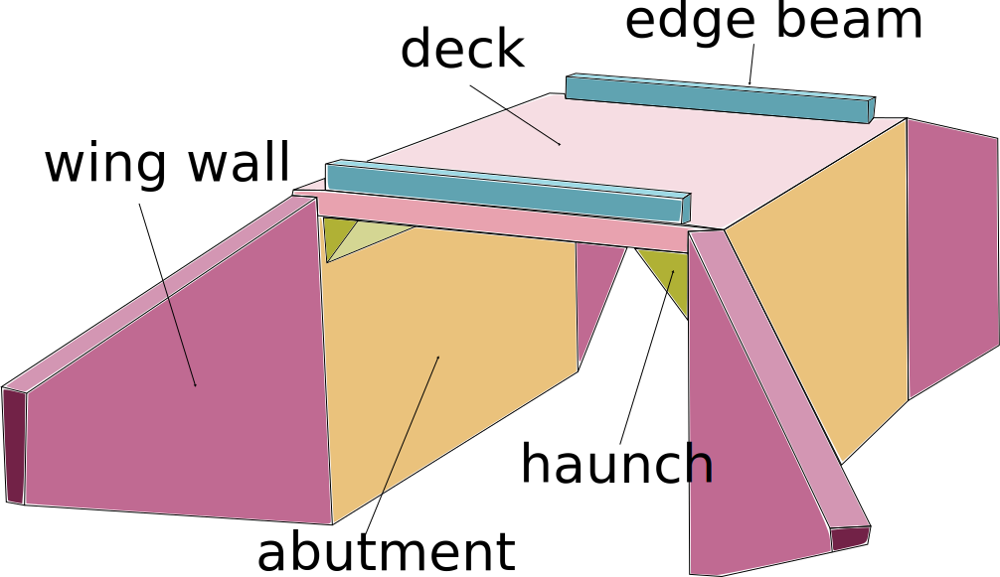

# Artificial Intelligence assisted bridge inspection

>**_Disclaimer:_** This work is part of the project MIRAUAR (Méthode d’assistance à l’Inspection et à la visite d’ouvrages d’art par Réalité AUgmentée et intelligence ARtificielle). The project MIRAUAR received a grant from the call for projects Ponts Connectés funded by the French State and led by [Cerema](https://www.cerema.fr/en) which aims to improve bridge management by using the most recent techniques in terms of monitoring, data transfer and data processing. I would therefore like to thank Cerema for organizing this call for projects and for its scientific involvement in the follow-up of the project.

The general aim of the project is to create tools and methods to assist in semi-automatic bridge inspections performed by non-experts with a mobile device.

In this direction, a CNN model performing semantic segmentation of the bridge structural components in integrated in the inspection application. To train this model, a synthetic dataset of portal frame bridges is created in order to tackle the lack of sufficient annotated real images.

Portal frame bridges are concrete monolithic structures, in the sense that their decks and abutments form one block. They constitute a large number of medium to small bridges found in urban and rural settings.

This work is organised in the following tasks:

- [Generation of a synthetic dataset of portal frame bridges from a geometric model.](src/bridge_synthetic)

- [Semantic segmentation of bridge structural components.](src/bridge_component_segmentation)

- [Inferring bridge geometric parameters from a labeled point cloud.](src/bridge_sizing)
