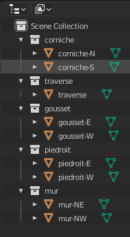

# Bridge Sizing

## Prerequisites

### Package versions
Python version [3.10.2](https://www.python.org/downloads/release/python-3102/) with Blender built as [python module](https://wiki.blender.org/wiki/Building_Blender/Other/BlenderAsPyModule).

`requirements.txt` contains the necessary packages.

**If a virtual environment is used in MacOS, it should be installed with `--enable-framework` option**

<!-- #### Blender file structure
A specific structure is assumed in the blender file, in order for this code to work.
In particular:
- Bridge components are represented as separate blender objects.
- Each object belongs in a collection. The collection's name is the object's semantic class. One or more objects can belong to the same collection.

Example of such a blender file structure:


To produce such a file from a parametric JSON file, see the `generate_3d_semantic_models.py` script of the [Synthetic data generation](../Modelling/Synthetic_dataset_generation) task. -->

## Sizing parameters inference

>**_NOTE:_** Optimization details should go here when finalized

We use constrained optimization in order to infer the bridge size parameters from
a labeled point cloud.

This functionality will be used with augmented reality, in the mobile inspection application.

### Usage

The sizing functionality is executed by the `sizing.py` script.
The script takes 3 (potential) arguments.

|Argument|Argument type| Interpretation|Default value|Required|
|--------|-------------|---------------|-------------|--------|
|`-pc`|`string` value|file path to the labeled point cloud[acceptable formats: `.glb`]|-|&#10003;|
|`-b`|`string` value|path to a file defining the basic structure of the bridge [acceptable formats: `.json`]|`./json/skeleton.json`|&#10008;|
|`-o`|`string` value|path to save a json file containing the inferred parameters |`./parameters.json`|&#10008;|
|`-n`|`float` value|ratio of noise to insert to the point cloud (only useful for artificial point clouds that are perfect) in [0,1] | 0 |&#10008;|

The basic skeleton file is of the same structure as a `.json` file descibing a bridge, but all the dimension values are `null`, only the dependencies are noted.
```json
{
    [
      {
        "index": 0,
        "label": "traverse",
        "nom": "traverse",
        "couleur": 8421504,
        "dimensions": {
          "longueur": {
            "d1": null,
            "d2": null,
            "dec": null,
            "contrainte": -1,
            "contraintedec": -1
          },
          "largeur": {
            "d1": null,
            "d2": null,
            "dec": null,
            "contrainte": -1,
            "contraintedec": -1
          },
          "hauteur": {
            "d1": null,
            "d2": null,
            "dec": null,
            "contrainte": -1,
            "contraintedec": -1
          }
        },
        "angle": {
          "heading": {
            "v": null,
            "contrainte": -1
          },
          "tilt": {
            "v": null,
            "contrainte": -1
          },
          "roll": {
            "v": null,
            "contrainte": -1
          }
        },
        "contrainte": {
          "element": -1,
          "n1": -1,
          "n2": -1
        }
      },
  .
  .
  .
}
```

The script can be therefore run as:
```console
python sizing.py -pc path/to/pointcloud.glb -b path/to/skeletonfile.json
```
There is also the possibility to add all input arguments in a `.txt` file and parse it
as input to the script. In that case the script can be run as:
```console
python sizing.py @config.txt
```

### JSON output

A simple (not nested) dictionary is saved in the same directory as the script (unless
otherwise defined), containing a list of `dimension_description: value` elements.

The output parameters file has the following format:
```json
{
  "traverse.width.d1": 15,
  "traverse.width.d2": 15,
  "traverse.width.offset": 0,
  "traverse.length.d1": 21.74,
  "traverse.length.d2": 21.5,
  "traverse.length.offset": 2.55,
  "traverse.height.d1": 0.5,
  "traverse.height.d2": 0.5,
  "traverse.height.offset": 0,
  "traverse.roll.v": -3,
  "traverse.tilt.v": 0,
  "traverse.heading.v": 0,
  .
  .
  .
}
```

### Preprocessing and cleaning steps

#### Point cloud filtering/cleaning

Two steps are taken to clean the point cloud as much as possible.
- A majority filter is applied. We know that the bridge is composed of solid consistent elements, so in a perfect point we should not have individual voxels or voxel groups of a class inside a mass of another class. This is why we apply a filter where each 3d point gets the label that is mostly present in the points around it.

- [RANSAC](https://en.wikipedia.org/wiki/Random_sample_consensus) is used to eliminate outliers. Since we know that bridge surfaces are planes, for each class we use RANSAC to fit a plane to the class points. All points that do not belong to the plane are eliminated from the point cloud. This step presupposes the quality of the point cloud labels is good enough to contain the majority of a class's points in the actual class's location.

#### Model initialization

The bridge model is initialized with dimensions simply taken as the *peak to peak differences* of the point cloud. Each bridge elements has some dimension **bounds** that are applied to ensure that the initial dimensions stay within acceptable limits.

#### Model to point cloud alignement

The point cloud is moved around zero mean. However, moving the model around zero mean as well does not guarantee the relative alignement of the two.

>**_IMPORTANT:_** The sizing process infers the model's dimensions and rotations, and not the models placement in the 3d space. An ineffective initial placement can compromise the dimension optimization process.

To overcome this, we use an [brute force](https://en.wikipedia.org/wiki/Brute-force_search) global optimization scheme to infer how much we have to move the model in 3D space so that the model's **deck** and the point cloud's **deck** are aligned. *The deck is the best reference structural component for such an initial alignement*.

An example of the position of the deck (black-edged square) with respect to the point cloud before and after the alignement is shown below:
<center>
<table style="margin-left:auto;margin-right:auto;">
  <tr>
    <td>
      
    </td>
    <td>
      
    </td>
   </tr>
   <tr>
      <td>before alignement</td>
      <td>after alignement</td>
  </tr>
</table>
</center>

Note that this step only places the deck so that the deck points are contained inside it, **it does not change its dimensions**.

#### Dimension inference

The bridge consists of hexahedral building blocks, each block defined by **12** parameters (3 for each dimension, 1 for each rotation).

The entire bridge is therefore composed of **~112** parameters, of which about **96** are independent.

##### Bounds
Each parameter may or may not be bound, meaning limited to have a value in a given **absolute** range. All absolute bounds are imposed so that the values do not exceed the acceptable ranges.

##### Constraints
Some parameters depend on other parameters of the same or a different building block.
The relation between the dependent and the independent variable is expressed as a **linear equality or inequality constraint**. Those constraints are also passed to the optimization function.

##### Per block optimization
Given the high complexity and dimensionality of the problem, each block is individually optimized. The order of the block optimization matters, since some blocks depends on others. We start from the deck.

The objective function is a sum of squared distances:
The sum of the minimum distance of each point from a hexahedral surface is calculated for each point of the point cloud with a diven label. (e.g. The sum of minimum distances of the points labeled as deck from the deck building block, etc.)

### Sizing completed

If all the sizing parameters could be defined, the aforementioned JSON file will
be saved, and the script will exit with code 0.

### Sizing failed or incomplete

In case one or more of the bridge dimensions cannot be inferred, it's corresponding
value will be `null`.

The `sizing.py` will still save the incomplete JSON, but it will also print an error
message, and exit with code 1.

### Examples

#### Artificial point clouds
 A number of fake point clouds are generated in Blender in order to experiment.
 Those point clouds are simplified, and their labels are perfect. They can be found in the folder **samples->mock_pont**.


 <table style="margin-left:auto;margin-right:auto;">
   <tr>
     <td>
       
     </td>
     <td>
       
     </td>
     <td>
       
     </td>
    </tr>
    <tr>
       <td>simple bridge, just deck and abutment</td>
       <td>simple bridge, offset on deck length</td>
       <td>complete artificial bridge</td>
   </tr>
 </table>


### Work in progress

At the time the optimization of the bridge parameters (dimensions) in order to create an accurate digital twin is not complete.

There are some issues that need to be addressed:

- The feature vector is composed of elements that represent different physical quantities (dimensions in meters, rotation in degrees). Also, each dimension has a different range. This means that the search space for each parameter is different, something that makes the optimization difficult. This could be addressed by:
    - Some kind of normalization, although not sure which.
    - The setting of bounds for the search space of each feature. I am not sure if this
      is a possibility in `scipy.optimize`.
    - Global optimization search within bounds. The way the model is formalized, those bounds should be specific to each building block, and may be relative to other building blocks.

- The robustness of the algorithm should be thorougly checked. Is it equally capable to infer dimensions, rotations, offsets?

- The objective function at the moment is the summed square error of the minimum distance of each point from the model surface. This does not penalize large model blocks, that extend beyond the point cloud limits (as the minimum distance is always the same). Another term should be added in the objective function to guarantee a tight fit.
    - check [Hausdorff distance](https://cgm.cs.mcgill.ca/~godfried/teaching/cg-projects/98/normand/main.html)
    - check [Chamfer Distance](https://github.com/UM-ARM-Lab/Chamfer-Distance-API)
    - check some form of [intersection over union (IoU)](https://en.wikipedia.org/wiki/Jaccard_index), area, volume, or number of points.
    - or other geometric consistency metrics to fit a mesh to a point cloud.

- For the moment the constraints are written only for the deck, and the experiments focused on inferring the deck dimensions. This should be extended to the other elements, or potentially an approach aiming to infer all the bridge parameters together can be imagined (although that increases a lot the dimensionality.)

- There is still some unexpected behavior with the `scipy.optimize.minimize` functionality. Sometimes, during the minimization iteration it throws an `out of bounds` error, that I am not sure how to address, since the initial guess is well within bounds. The error only occurs when `keep_feasible` is set to `True` for the bounds.

<!-- - *I think we need more bounds and constraints, basically at least one for each parameter (feature), since none can go to infinity. For example, how come we have no bound nor constraint for the deck (traverse) length (largeur)? -> done to the best of my knowledge for the dimensions*  -->

## IFC Builder

We use [Blender](https://www.blender.org/), its python API ([bpy](https://docs.blender.org/api/current/index.html)) and the [BlenderBIM](https://blenderbim.org/) addon to generate an IFC file representing a bridge.

This model with be used with augmented reality, in the mobile inspection application.

### Usage

The IFC builder functionality is executed by the `ifc_builder.py` script.
The script takes 3 (potential) arguments.

|Argument|Argument type| Interpretation|Default value|Required|
|--------|-------------|---------------|-------------|--------|
|`-i`|`string` value|input file path [acceptable formats: `.json`]|-|&#10003;|
|`-b`|`string` value|path to a file defining the basic structure of the bridge [acceptable formats: `.json`]|`./json/skeleton.json`|&#10008;|
|`-o`|`string` value|path to save the resulting ifc to |`./bridge.ifc`|&#10008;|

If the BlenderBIM addon is not enabled the script enables it. If it is not installed, the script installs and then enables it. The installation `.zip` files are included in the `addons` folder, but a different version might need to be downloaded from https://blenderbim.org/download.html, depending on the user's system. In that case, the corresponding filepath in `blender_utils.py` should be also updated.


The format of the input JSON file is the same as that of the [output](#JSON-output) of the `sizing.py` script.

The script can be therefore run as:
```console
python ifc_builder.py -i ./json/parameters.json -b ./json/skeleton.json -o geometric_models/bridge.ifc
```
There is also the possibility to add all input arguments in a `.txt` file and parse it
as input to the script. In that case the script can be run as:
```console
python ifc_builder.py @config_ifc_builder.txt
```


### IFC output
An IFC file is saved in the output file, if specified, or in the same directory as
the script otherwise.

The correspondance between bridge semantic classes and IFC classes is (IFC4 version):

| Semantic class | IFC class |
| ----------- | ------------- |
| deck / traverse | IfcRoof |
| abutment / piedroit | IfcColumn |
| wing_wall / mur | IfcWall |
| haunch / gousset | IfcSlab |
| edge_beam / corniche | IfcPlate |
| ground   | IfcFooting |

>**_NOTE:_** [IFC4x3](https://ifc43-docs.standards.buildingsmart.org/IFC/RELEASE/IFC4x3/HTML/lexical/IfcBeamTypeEnum.htm) version contains IFC classes more particular for bridges, however it is for the moment not implemented in BlenderBIM, which is why we do not use it.

The name of each geometric element in the IFC format describes its type and its position on the bridge. The convention is as follows:

<center></center>
